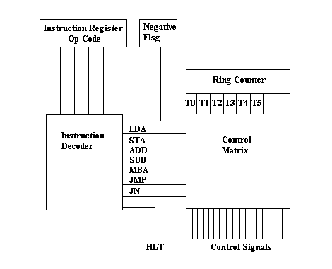

# Single Board Computer System
Actually the name **beautyOf6502** is misleading. This isn't some *MOS processors* project, it's just I like the name, and impact these technologies stood influenced in the late 90s from powering *Atari 2600* to *Apple II*. These "*Processors*" ones requires room full of space to fit, now can be integrated with whole computer architecture in our fingertips, became so small given the name "*Microprocessor*". But what I intent here is the opposite, building one to the level of monstrosity.

Also I want to build something from what I've learned, going to learn in the process and check if **I** can. This is my attempt to make a full working **8-Bit Computer** straight from ICs, resitors and other electronic components.

## Features
- Based on Harvard Architecture.
- *Equivalent* to RISC Processor Architecture.
- Suffecient Memory for RAM and ROM.
- Paralle, Serial and Analog I/O Capabilities.

## Block Diagrams
This shows the functional relationships between the various parts of the system.  

  

---
CPU:

## Hardware
A variety of electronic components are used in this project, listed [here](requirements.csv).

## Schematics

## PCB Design
Ambitious future dev. [Gerber file](https://easyeda.com/).  

## Software

## Instruction Set
Detail usage for the 20 terminal commands. Upper, Lower and Random case letters are allowed with last 4-digit round-off hex-addressing.
[Command Summary](commands.csv).

## [Bill of Materials](BOM.csv)

## Motivation
- [James Newman](http://www.megaprocessor.com/)
- [The MOnSter 6502](https://monster6502.com/)
- The [Javascript Simulator](http://visual6502.org/JSSim/) build, reverse engineering by [Visual 6502 Team](http://visual6502.org/) and their generous thought of [open sourcing](https://github.com/trebonian/visual6502).
- [Digital Computer Electronics](https://www.scribd.com/document/332484423/Digital-Computer-Electronics-3rd-Edition-Malvino) by **Albert P. Malvino**.
- [But How Do I Know]() by **J Clark Scott**.
- [SBMCS](http://www.cs.binghamton.edu/~reckert/sbc.htm) by **Prof. Richard R. Eckert** of Binghamton University, New York.

## License
Copyright (c) 2018 Aniruddha Pandey and contributors. All rights reserved. 
Licensed under the MIT license. See [LICENSE](LICENSE) file in the project root for full license information.
